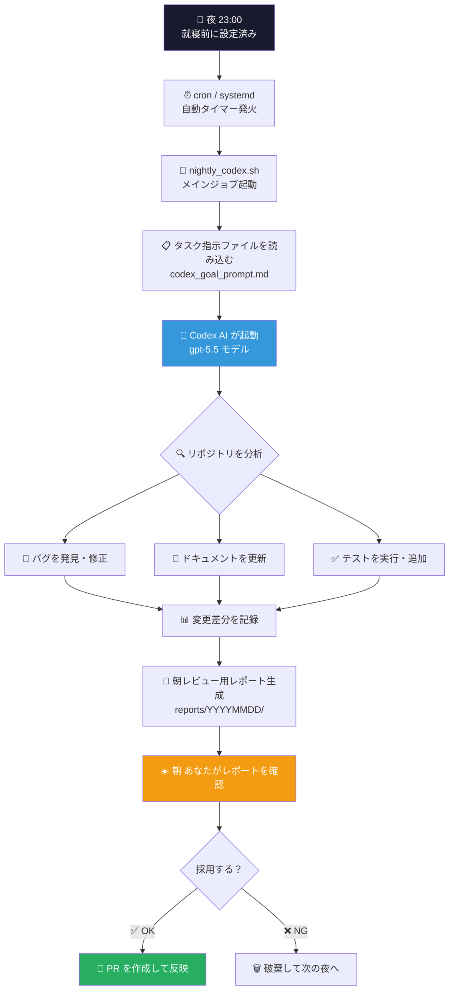
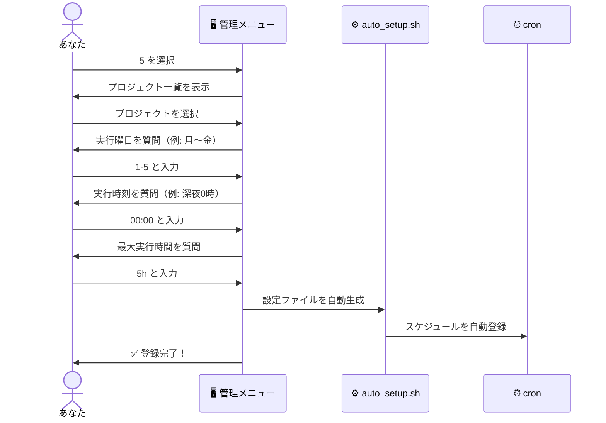
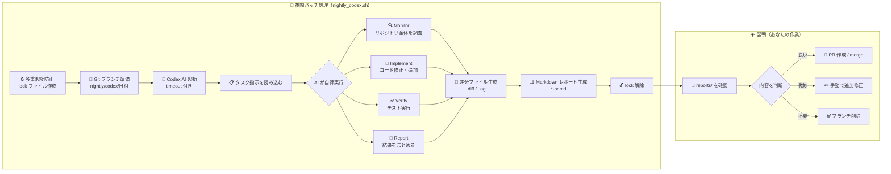
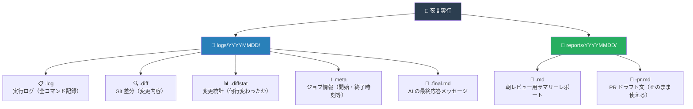
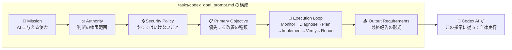
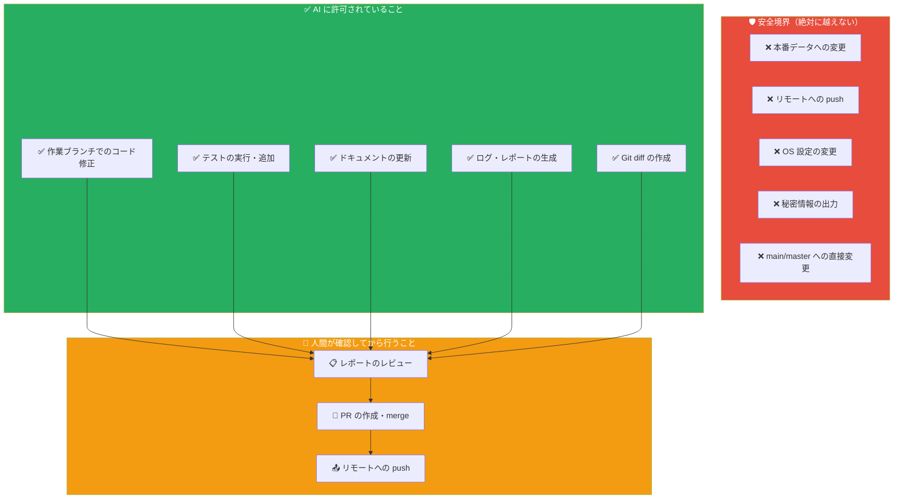
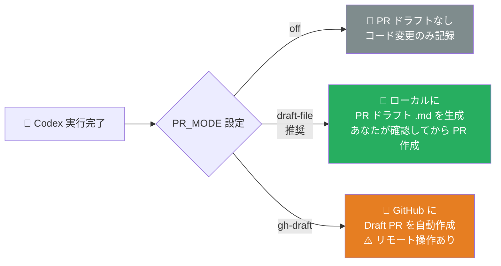
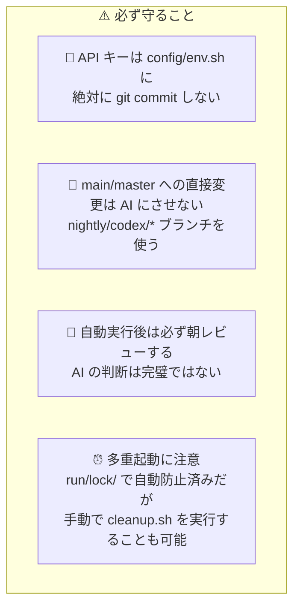

# 🚀 Codex StartUpTools

> **「寝ている間に AI がコードを書き、朝には報告書が届く」**
> Ubuntu Linux 上で動く、Codex AI 完全自律開発の運用パッケージです。

<div align="center">

[](#検証)
[](#)
[](#)
[](#)

</div>

---

## 🎯 このツールは何をするの？

```
  あなた                Codex StartUpTools              AI (Codex)
    │                         │                              │
    │  夜 寝る前に             │                              │
    │──「このリポジトリを       │                              │
    │    改善してね」 ─────────▶│                              │
    │                         │  自動でタスク指示を送る ──────▶│
    │                         │                              │ コードを読む
    │                         │                              │ 問題を発見する
    │                         │                              │ 修正する
    │                         │                              │ テストする
    │  朝 起きたら             │◀───── 結果レポートを返す ─────│
    │◀── 「完了報告書が届いてる！」│                              │
```

**一言で言うと：** 毎晩決まった時刻に AI（Codex）が自動起動し、指定したソフトウェアプロジェクトを自律的に改善・開発して、朝には人間がレビューできる状態にしてくれるツールです。

---

## 🌙 全体の流れ（夜間自律開発サイクル）



---

## 📦 ファイル構成マップ

```
Codex-StartUpTools/
│
├── 🎮 bin/                        ← 実行スクリプト（操作の入口）
│   ├── codex_menu.sh              ← 🖥️ メインメニュー（ここから全部操作）
│   ├── codex_startup.sh           ← 🚀 Codex 起動ランチャー
│   ├── nightly_codex.sh           ← 🌙 夜間バッチ実行の本体
│   ├── auto_setup.sh              ← ⚙️  全自動セットアップ
│   ├── prepare_repo.sh            ← 🌿 Git ブランチ準備
│   ├── summarize_result.sh        ← 📊 朝レビュー用レポート生成
│   └── cleanup.sh                 ← 🧹 後片付け
│
├── 📚 lib/                        ← 共通ライブラリ（内部部品）
│   ├── common.sh                  ← 🔩 基本ユーティリティ
│   └── startup.sh                 ← 🎨 メニュー表示・cron 管理
│
├── ⚙️  config/                    ← 設定ファイル置き場
│   ├── jobs.conf.example          ← 📋 夜間ジョブ設定テンプレート
│   ├── env.sh.example             ← 🔑 環境変数テンプレート（API キー等）
│   └── startup.conf.example       ← 🖥️ メニュー設定テンプレート
│
├── 📝 tasks/                      ← AI への指示書
│   ├── codex_goal_prompt.md       ← 🎯 標準 Goal プロンプト（自由に編集可）
│   └── default_task.md            ← 📌 短い保守タスク例
│
├── 🚀 deploy/                     ← 本格運用用の設定テンプレート
│   ├── ai-nightly.service.example ← 🔧 systemd サービス定義
│   └── ai-nightly.timer.example   ← ⏰ systemd タイマー定義
│
└── 🧪 tests/                      ← 自動テスト
    └── run_tests.sh               ← ✅ 14 項目の品質チェック
```

---

## 🖥️ 管理メニュー（操作の全体像）

`./bin/codex_menu.sh` を実行すると以下のメニューが表示されます。

```
╔════════════════════════════════════════════════════════════╗
║  🚀 Linux Codex StartUp Tools   Bash / Codex CLI / cron   ║
╚════════════════════════════════════════════════════════════╝

  🚀 Codex StartUp ダッシュボード
  🏠 ルート        : /home/user/Codex-StartUpTools
  🤖 Codex         : ✅ 検出済み
  📦 検出PJ数      : 26

  🧭 管理メニュー
  1. 📊  ダッシュボード表示     [状態・設定・検出数]
  2. 📦  プロジェクト一覧       [/home/user/Projects]
  3. 🤖  Codex 起動             [選択プロジェクトで対話起動]
  4. 🧪  Codex 起動 dry-run     [実行せず計画確認]
  5. 🕛  nightly セットアップ   [曜日・時刻・最大実行時間指定]
  6. 🔍  nightly dry-run        [設定検証]
  7. 🚀  nightly 今すぐ実行     [バックグラウンド起動]
  8. 🕘  最近のプロジェクト     [起動履歴]
  9. 🗓️  管理 cron              [一覧・変更・削除]
 10. ✅  make verify             [構文・lint・テスト]
 11. 📋  Codex goal prompt 起動  [goal プロンプトで自律実行]
  0. 🚪  終了
```

### 📋 メニュー機能の早見表

| 番号 | アイコン | 機能名 | 誰が使う？ |
|:----:|:------:|:------|:---------|
| 1 | 📊 | 現在の状態を一覧表示 | 毎日の確認に |
| 2 | 📦 | プロジェクト一覧を表示 | 対象選択時に |
| 3 | 🤖 | Codex を対話モードで起動 | 会話しながら開発したいとき |
| 4 | 🧪 | 実行せず「何をするか」だけ確認 | **初めて使うとき必ず** |
| 5 | 🕛 | 夜間自動実行を登録 | セットアップ時に一度 |
| 6 | 🔍 | 夜間設定の検証 | 設定変更後の確認に |
| 7 | 🚀 | 今すぐバックグラウンド実行 | すぐ試したいとき |
| 8 | 🕘 | 過去の起動履歴を確認 | 振り返りに |
| 9 | 🗓️ | cron スケジュールの管理 | タイミング変更に |
| 10 | ✅ | コード品質チェック | 開発・修正後に |
| **11** | 📋 | **Goal プロンプトで完全自律実行** | **夜間開発の手動起動に** |

---

## ⚡ クイックスタート（3ステップ）

### ステップ 1：管理メニューを起動する

```bash
./bin/codex_menu.sh
```

### ステップ 2：プロジェクトに対して夜間自動実行を登録する（メニュー 5）



### ステップ 3：翌朝レポートを確認する

```bash
# 昨日の夜間実行レポートを確認
ls reports/$(date '+%Y%m%d')/
```

---

## 🤖 AI が夜間に何をするのか（詳細フロー）



---

## 📊 出力ファイルの種類と用途



---

## ⚙️ セットアップ詳細

### 手動セットアップ（細かく設定したい場合）

```bash
# 1. 設定ファイルをテンプレートからコピー
cp config/jobs.conf.example  config/jobs.conf
cp config/env.sh.example     config/env.sh

# 2. 実行権限を付与
chmod +x bin/*.sh tests/run_tests.sh

# 3. jobs.conf を編集（対象リポジトリのパスを設定）
#    REPO_PATH="/home/あなた/Projects/your-repo"
#    REPO_NAME="your-repo"
#    BASE_BRANCH="main"
```

### 設定ファイルの役割

| ファイル | 役割 | コミットする？ |
|:--------|:-----|:------------:|
| `config/jobs.conf` | 夜間ジョブの設定（リポジトリパス・モデル等） | ❌ しない |
| `config/env.sh` | API キー等の秘密情報 | ❌ **絶対にしない** |
| `config/startup.conf` | メニューの設定（プロジェクトフォルダ等） | ❌ しない |
| `config/*.example` | 上記のテンプレート | ✅ する |

---

## 📋 Goal プロンプトのカスタマイズ

`tasks/codex_goal_prompt.md` を編集することで、AI への指示内容を変えられます。



> **ポイント：** この指示書は「CTO からの指令書」のようなものです。  
> AI はこの内容を読んで、何を優先して改善すべきかを自分で判断します。

---

## 🛡️ 安全設計（AI が「暴走」しないために）



---

## 🗓️ cron スケジュールの例

```
┌─────────── 分 (0-59)
│  ┌──────── 時 (0-23)
│  │  ┌───── 日 (1-31)
│  │  │  ┌── 月 (1-12)
│  │  │  │  ┌─ 曜日 (0=日, 1=月, ..., 6=土)
│  │  │  │  │
0  0  *  *  *    毎日 深夜0時に実行
30 2  *  *  1-5  月〜金 深夜2:30に実行
0  1  *  *  0,6  土日 深夜1時に実行
```

**メニュー 5 を使えばこの設定は自動で行われます。**  
cron の書き方を知らなくても大丈夫です。

---

## 🔄 PR モードの違い



---

## ⚡ コマンドリファレンス

### 最初に試すコマンド（安全・変更なし）

```bash
# メニューを起動
./bin/codex_menu.sh

# ダッシュボードだけ表示（変更一切なし）
./bin/codex_menu.sh --once dashboard

# 夜間ジョブを「試しに動かして確認」だけ（実際には何もしない）
./bin/nightly_codex.sh --config config/jobs.conf --dry-run
```

### 全自動セットアップ

```bash
# リポジトリを指定するだけで全設定を自動化
./bin/auto_setup.sh --repo /home/あなた/Projects/your-repo --force

# smoke-run 付き（設定後に一度試験実行まで）
./bin/auto_setup.sh --repo /home/あなた/Projects/your-repo --force --smoke-run

# cron 登録なし（設定ファイル生成と検証だけ）
./bin/auto_setup.sh --repo /home/あなた/Projects/your-repo --schedule none --force
```

### 手動で今すぐ実行

```bash
# バックグラウンドで夜間ジョブを今すぐ起動（メニュー 7 と同等）
source config/env.sh
./bin/nightly_codex.sh --config config/jobs.conf

# Goal プロンプトで Codex をインタラクティブ TUI 起動（メニュー 11 と同等）
./bin/codex_startup.sh \
  --project /home/あなた/Projects/your-repo \
  --task tasks/codex_goal_prompt.md \
  --profile yolo \
  --interactive
```

---

## 📐 systemd タイマーによる本格運用

cron より信頼性が高い `systemd` タイマーを使う場合：

```bash
# 1. テンプレートをシステムにコピー
sudo cp deploy/ai-nightly.service.example /etc/systemd/system/ai-nightly.service
sudo cp deploy/ai-nightly.timer.example   /etc/systemd/system/ai-nightly.timer

# 2. パスとユーザーを環境に合わせて編集
sudo nano /etc/systemd/system/ai-nightly.service

# 3. 有効化して起動
sudo systemctl daemon-reload
sudo systemctl enable --now ai-nightly.timer

# 4. 状態確認
systemctl status ai-nightly.timer
```

---

## ✅ 検証（品質チェック）

```bash
# 全チェックを一括実行（推奨）
make verify

# 個別実行
make syntax  # Bash 構文チェック
make lint    # shellcheck 静的解析
make test    # 14 項目の自動テスト
```

### テスト項目の内容

| # | テスト内容 | 何を確認？ |
|:-:|:---------|:---------|
| 1 | dry-run 検証 | 試験実行がリポジトリを変更しないこと |
| 2 | skip-codex レポート生成 | AI 実行なしでもレポートが出ること |
| 3 | 非 Git ディレクトリの拒否 | Git 以外のフォルダでは動かないこと |
| 4 | auto_setup 設定生成 | npm プロジェクトの設定自動検出 |
| 5 | cron 登録 | 曜日・時刻・実行時間が正しく登録されること |
| 6 | 起動履歴記録 | dry-run でも履歴が残ること |
| 7 | メニュー one-shot | 非対話モードで動作すること |
| 8 | プロジェクト選択 | UI 出力とパスが分離されていること |
| 9 | 失敗時の回復 | エラーが起きてもメニューが落ちないこと |
| 10 | 共通アクション | ダッシュボード・一覧・dry-run が動くこと |
| 11 | auto_setup 画面遷移 | 曜日・時刻・時間の対話入力が通ること |
| 12 | cron 管理操作 | 変更・削除・全削除が正しく動くこと |
| 13 | TTY カラー | 視認性の高い配色が使われていること |
| 14 | バックグラウンド実行 | nightly ジョブが分離起動できること |

---

## 🚨 運用上の注意点



---

## 📚 ドキュメント一覧

| ファイル | 内容 |
|:--------|:-----|
| `README.md` | このファイル（全体の説明） |
| `AGENTS.md` | AI エージェント向けガイドライン |
| `docs/source-review.md` | 移植元との差分・設計判断メモ |
| `tasks/codex_goal_prompt.md` | AI への標準指示書（編集可） |
| `config/*.example` | 設定ファイルテンプレート |
| `deploy/*.example` | systemd 設定テンプレート |

---

## 🔗 関連リンク

- [OpenAI Codex CLI](https://github.com/openai/codex)
- [shellcheck](https://www.shellcheck.net/) — シェルスクリプト静的解析ツール
- [bubblewrap](https://github.com/containers/bubblewrap) — Linux サンドボックス

---

<div align="center">

**🌙 夜間に AI が働き、☀️ 朝にあなたが判断する。**  
**人間と AI の最適な役割分担を実現する CLI 運用パッケージです。**

</div>
